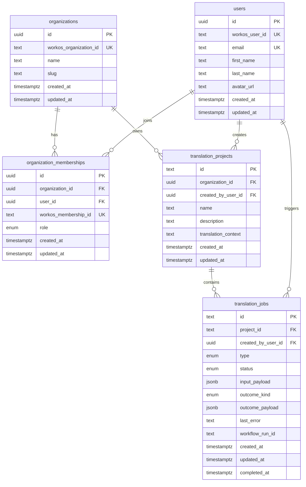

# Database Schema

This folder contains the Drizzle schema for the app database.

## Design

- `organizations`, `users`, and `organization_memberships` are local identity tables.
- WorkOS IDs are stored as external mapping fields so domain tables do not depend on vendor IDs.
- `translation_projects` belongs to an organization and may record the creating user.
- `translation_jobs` belongs to a project and may record the triggering user.

## Table Relationships

## Notes

- `organization_memberships` is the authorization join table between users and organizations.
- `translation_projects` and `translation_jobs` reference local UUIDs for users and organizations, not WorkOS IDs.
- WorkOS remains an upstream identity provider; the app database remains the primary source for relational integrity.
