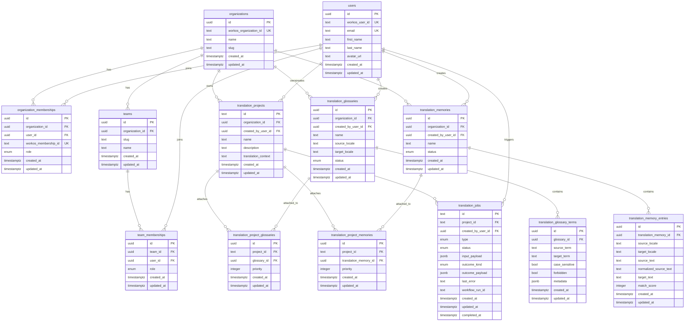

# Database Schema

This folder contains the Drizzle schema for the app database.

## Design

- `organizations`, `users`, and `organization_memberships` are local identity tables.
- `teams` and `team_memberships` are local collaboration tables nested under organizations.
- WorkOS IDs are stored as external mapping fields so domain tables do not depend on vendor IDs.
- `translation_projects` belongs to an organization and may record the creating user.
- `translation_jobs` belongs to a project and may record the triggering user.
- `translation_glossaries` and `translation_memories` are reusable organization-level translation assets.
- `translation_project_glossaries` and `translation_project_memories` attach those reusable assets to individual projects.
- `translation_projects.translation_context` remains the project-scoped freeform context field.

## Table Relationships

## Notes

- `organization_memberships` is the authorization join table between users and organizations.
- `teams` are local app-level subgroups inside an organization; WorkOS does not manage them.
- `team_memberships` controls collaboration inside an organization after org membership is established.
- `translation_projects` and `translation_jobs` reference local UUIDs for users and organizations, not WorkOS IDs.
- Reusable translation assets are owned at the organization layer, then attached to projects through join tables with `priority`.
- Glossary and TM content are normalized into term and entry tables.
- Project-specific freeform guidance should continue to use `translation_projects.translation_context`.
- WorkOS remains an upstream identity provider; the app database remains the primary source for relational integrity.
