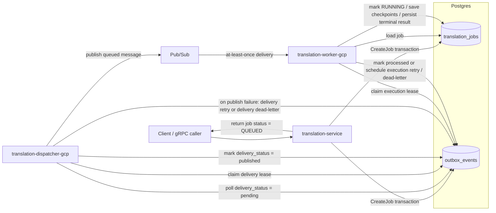

# Translation cloud outbox dispatcher design

## Context

The cloud translation path already persisted jobs and outbox rows in Postgres, but broker delivery still happened inline in the gRPC request path. That meant a request could commit a queued job and outbox row, fail to publish afterward, and return an error even though the durable state already existed.

The missing piece was a dedicated component that continuously replays committed outbox rows to Pub/Sub.

## Decision

The cloud translation flow now separates three responsibilities:

- `translation-service` accepts gRPC requests and durably stores queued jobs plus outbox rows
- `translation-dispatcher-gcp` polls committed outbox rows and publishes them to Pub/Sub with its own delivery retry state
- `translation-worker-gcp` claims execution ownership for broker deliveries and advances jobs through translation execution

The `outbox_events` table now carries two independent lifecycles:

- execution state used by workers while running the translation job
- delivery state used by the dispatcher while publishing to the broker

## Flow

## Data flow

1. `CreateJob` inserts a `translation_jobs` row with `QUEUED` status and an `outbox_events` row with both execution and delivery state initialized to pending.
2. `translation-dispatcher-gcp` polls Postgres for rows whose broker delivery is due.
3. The dispatcher claims a delivery lease so only one dispatcher instance publishes a row at a time.
4. On successful publish, the dispatcher marks broker delivery as published without mutating worker execution state.
5. On publish failure, the dispatcher schedules broker delivery retry with backoff or marks delivery dead-lettered after the configured maximum attempts.
6. Pub/Sub invokes `translation-worker-gcp` with at-least-once delivery semantics.
7. The worker claims the execution lease before processing. If another worker already owns the lease, the invocation exits as a duplicate.
8. The worker loads the referenced job, transitions it to `RUNNING`, persists checkpoint progress, and writes the terminal result or error.
9. The worker updates execution state on the outbox row to processed, pending-for-retry, or dead-lettered.

## Consequences

- API success now means durable persistence, not immediate broker acceptance
- broker delivery retries are owned by the dispatcher instead of the gRPC request path
- duplicate Pub/Sub deliveries are tolerated through execution leasing and idempotent job transitions
- one outbox table remains sufficient because broker delivery state and worker execution state are tracked separately
