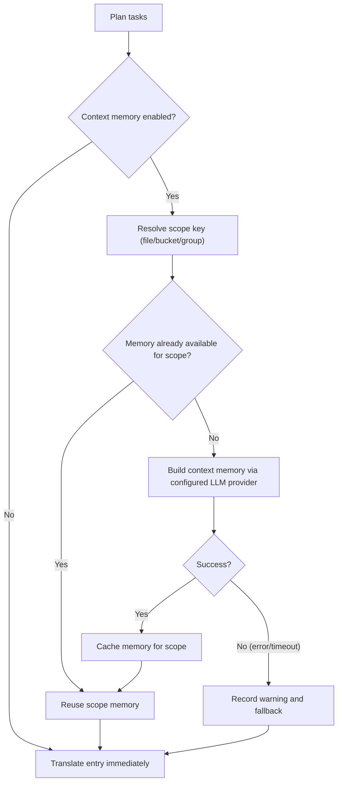

Complete the [quickstart](/cli/getting-started/quickstart) before changing advanced translation settings. Preview the same file and locale before and after a change, then review the resulting translations.

## Sentence segmentation (`srx`)

`run` can split string values with SRX 2.0 before translation. This is a text-level segmenter, not a JSON parser: each leaf stays one file key, and `run` writes the joined translation back to that key.

Enable it per mapping with `buckets.*.files[].srx`, or override every mapping for one invocation with `--srx`. Both accept `default`, `html`, `markdown`, or a project-relative SRX 2.0 file. Segmentation stays off when neither is set.

`run` skips already-segmented formats (XLIFF, PO, SRT, VTT, xcstrings, stringsdict) and FormatJS/ARB parser modes. Values that contain ICU, printf, or Fluent `{ $var }` placeholders stay one unit. Changing the SRX rules changes the lock hash so those tasks run again.

## Prompt contract for `run`

- `system_prompt` is used for instructions and runtime context.
- `user_prompt` is used for payload content (text to translate, or source content to summarize for context memory).
- Translation flow supports profile `user_prompt` override.
- Context-memory summary flow always uses the built-in summary payload template and does not apply profile `user_prompt` override.
- This entire prompt contract applies only to tasks routed to `type: llm`. Tasks routed to `type: mt` (see [Translation routing](/cli/configuration/i18n-config)) send raw source text directly to the configured MT provider and ignore `system_prompt`/`user_prompt`/`prompt` entirely — provider and behavior come from `mt.profiles.<name>` instead.

<Note>
Changing prompt structure (e.g. moving context from the user message to the system message) does not automatically invalidate remote cache entries. To force re-translation after a prompt restructure, bump the `prompt_version` in your profile.
</Note>

### Progress debug logging (optional)

To troubleshoot progress rendering, you can enable debug logs without changing CLI flags:

- `HYPERLOCALISE_PROGRESS_DEBUG=1` enables progress debug logging.
- `HYPERLOCALISE_PROGRESS_DEBUG_FILE=<path>` overrides log file location.

Default log path when enabled: `.hyperlocalise/logs/run.log`.

## Machine translation (MT) execution

Tasks routed to `type: mt` (via `translation.default`/`translation.rules`) execute differently from LLM tasks:

- **Batching**: `run` groups MT tasks by `(profile, source locale, target locale)` and sends up to 50 source strings per request. Larger groups are split into multiple sequential requests automatically.
- **Retries**: each MT request batch is retried up to 3 attempts total, with exponential backoff between attempts. Only transient failures are retried — request timeouts, rate limiting, and upstream-unavailable responses. Authentication failures, validation errors, and unsupported-language-pair errors fail immediately without retrying.
- **No automatic fallback to LLM**: if an MT batch fails after retries are exhausted, `run` records the affected tasks as failures (same as any other translation failure) — it does not reroute them to an LLM profile. If you need an LLM as a backstop for MT failures, re-run the failed tasks manually with a config that routes them to `type: llm`.
- **Validation failures**: source text that the MT provider rejects outright (for example, an unsupported language pair) is not retried and is recorded as a task failure with the provider's error message.
- **Missing credentials fail the whole run before any task executes**: `run` resolves and connects every MT profile that is actually selected by a planned task before translating anything, so a missing or empty credential environment variable fails the run immediately, rather than partway through. MT profiles defined in `mt.profiles` but never selected by a `translation` rule or default are not checked at all.

### Character usage reporting

MT tasks report character counts instead of LLM token counts. In the `--output` JSON report (see "Output fields" below), MT usage appears at three levels: run-level totals, per-locale (`localeMTUsage`), and per-MT-profile (`mtUsageByProfile`). Each usage entry includes `sourceChars`, `translatedChars`, `requestCount`, and `durationMs`. Unlike LLM token usage, MT character usage is not printed in the plain-text stdout summary — read it from the `--output` JSON artifact.

<Note>
Two features are restricted to LLM routing, with different failure behavior:

- **Image localization** requires `type: llm` with `provider: openai`. Routing an image source to `type: mt`, or to an LLM profile using a different provider, fails with a planning error before any translation runs.
- **`--experimental-context-memory`** only builds and applies context memory for `type: llm` tasks. Enabling it for a group that routes to `type: mt` does not error — MT tasks in that group simply run without context memory, silently.
</Note>

## Experimental context memory flow

When `--experimental-context-memory` is enabled, `run` builds shared memory once per scope (default: per source file), then reuses it for all entries in that scope.

If memory generation fails or times out, `run` logs a warning and continues translation without shared memory for that scope.

### Why it can appear to wait

- First entry in a new scope waits for memory generation to finish.
- Later entries in the same scope reuse the existing scope memory and proceed without rebuilding.
- Progress UI now shows context-memory steps in the file list so you can see active scope-level work.

## Next

See [run flags](/cli/commands/run#flags) and the [configuration reference](/cli/configuration/i18n-config).
