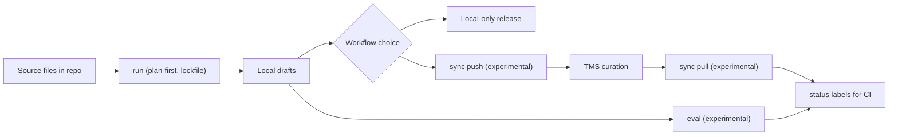

The `hyperlocalise` CLI generates local translation drafts, optionally syncs with Cloud or your TMS, and tracks what still needs review.

For the Cloud workspace — infrastructure for multilingual content operations — see [Hyperlocalise Cloud](/).

## CLI focus

- LLM provider layer: OpenAI, Azure OpenAI, Gemini, Anthropic, AWS Bedrock, LM Studio, Groq, Ollama
- TMS adapters (experimental): Crowdin, LILT AI, Lokalise, Phrase, POEditor, Smartling
- Eval framework (experimental): quality + regression checks across locales/models
- CI-ready status labels (experimental): `ready` / `needs review` / `missing`
- Plan-first + lockfile: deterministic runs and reviewable diffs

## Feature graph

## Who this is for

Use this CLI if you:

- keep translation files in your repository,
- want AI-generated drafts as a starting point,
- want to choose between zero-human workflows and optional human curation in your TMS.

## Core workflow

| Stage | Action | Why it matters |
| --- | --- | --- |
| 1 | [`init`](/cli/commands/init) | Scaffold `i18n.yml` and bootstrap defaults. |
| 2 | Configure [`i18n config`](/cli/configuration/i18n-config) | Define locales, buckets, and LLM/storage settings. |
| 3 | [`run --dry-run`](/cli/commands/run) | Validate plan and detect issues before writing drafts. |
| 4 | [`run`](/cli/commands/run) | Generate local draft translations. |
| 5 | [Release from local repo](/cli/commands/run) | Zero-human path when your process allows direct publish from generated outputs. |
| 6 (optional) | [`sync push` (experimental)](/cli/commands/sync-push) | Upload local changes to your TMS for curation workflows. |
| 7 (optional) | Curate in TMS | Human review and correction in your translation platform. |
| 8 (optional) | [`sync pull` (experimental)](/cli/commands/sync-pull) | Bring curated translations back into the repository. |
| 9 | [`status`](/cli/commands/status) | Measure completion and unresolved work in either workflow path. |

## Start in 10 minutes

1. [Installation](/cli/getting-started/install).
2. [Run quickstart](/cli/getting-started/quickstart).
3. [Set up your i18n config](/cli/configuration/i18n-config).

## Common next steps

- Sync a repo with Cloud: [Connect the CLI](/platform/cli).
- Learn command behavior in [commands overview](/cli/commands/overview).
- Configure provider credentials in [provider credentials](/cli/configuration/provider-credentials).
- Understand TMS adapter sync in [storage overview](/cli/storage/overview).
- Review feature maturity in the [stability matrix](/cli/reference/stability-matrix).
