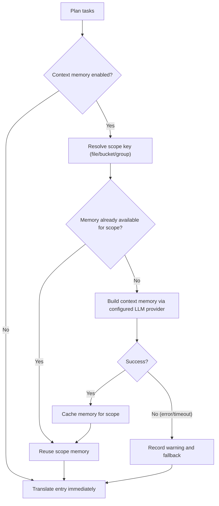

## Usage

```bash
hyperlocalise run [--config <path>] [--group <name>] [--bucket <name>] [--file <path>] [--locale <locale>] [--dry-run] [--workers <count>] [--output <report.json>] [--experimental-context-memory] [--context-memory-scope <file|bucket|group>] [--context-memory-max-chars <count>]
```

## Behavior

1. load and validate config,
2. plan tasks from groups and buckets,
3. skip tasks already in `.hyperlocalise.lock.json`,
4. execute remaining tasks,
5. persist successful tasks to lock state.

For lockfile fields, lifecycle, and reset guidance, see [Lockfile contract](/reference/lockfile-contract).

## Supported local file formats

`run` can read source and target files with these extensions:

- `.json`
- `.jsonc`
- `.yaml` and `.yml`
- `.js`, `.jsx`, `.mjs`, `.cjs`, `.ts`, `.tsx`, `.mts`, and `.cts`
- `.arb`
- `.xlf`, `.xlif`, and `.xliff`
- `.po`
- `.html`
- `.liquid`
- `.md`
- `.mdx`
- `.strings`
- `.stringsdict`
- `.xcstrings`
- `.csv`
- `.php`
- `.ftl`
- Android XML `strings.xml` files at `**/res/values*/strings.xml`
- `.xml` and `.resx` for generic XML locale files
- `.properties`

For JSON (`.json`), `run` supports:

- standard nested key/value JSON objects
- FormatJS message JSON when the root strictly matches:
  `{"[id]": {"defaultMessage": "[message]", "description": "[description]"}}`

In FormatJS mode, only `defaultMessage` is translated. Keys (message IDs), `description`, and other non-message metadata are preserved.

For JavaScript and TypeScript locale modules (`.js`, `.jsx`, `.mjs`, `.cjs`, `.ts`, `.tsx`, `.mts`, `.cts`), `run` supports static locale object exports:

- `export default { ... }`
- `export const messages = { ... }`
- `module.exports = { ... }`
- `const messages = { ... }; export default messages`

Nested objects are flattened to dotted keys, string arrays use bracket indexes, and strict FormatJS-style entries translate only `defaultMessage` while preserving `description` metadata. Comments, imports, export syntax, and `as const` are preserved on write. Dynamic values, computed keys, spread properties, multiple exported locale objects, and template literals with `${...}` interpolation fail with a parser error instead of being rewritten.

When an existing JS/TS target module has the same key set as the source, `run` writes into the target template so translator comments and existing module layout are kept. If the source key set changes, `run` falls back to the source template to avoid merging mismatched object shapes.

For YAML/YML (`.yaml`, `.yml`), `run` supports mapping-shaped locale files with string leaves. Nested mappings become dotted keys, sequences become `[index]` keys, and writeback rewrites existing string leaves while preserving key order/comments where possible. Mapping keys cannot contain `.`, `[`, or `]` because those characters are reserved for flattened paths. Non-string scalar leaves such as numbers, booleans, nulls, timestamps, anchors, and aliases are rejected to avoid silent corruption.

For Flutter ARB (`.arb`), `run` translates only message keys, preserves metadata keys such as `@key`, and normalizes `@@locale` to the target locale on write.

For Markdown and MDX (`.md`, `.mdx`), `run` translates extracted prose and preserves non-translatable structure:

- frontmatter blocks (`---`)
- fenced code blocks (```` ``` ```` and `~~~`)
- inline code spans
- Markdown anchors such as link destinations
- MDX `import` and `export` lines
- JSX/MDX component tags and attribute values

For HTML (`.html`), `run` translates text content inside block-level elements:

- `<script>`, `<style>`, `<pre>`, and `<head>` content is never translated and is preserved verbatim
- inline tags within translatable segments (`<strong>`, `<em>`, `<a>`, etc.) — tag markup is protected as placeholders and restored verbatim after translation, but the surrounding prose **is** translated
- `` — the `alt` attribute value is extracted as its own translation unit; the rest of the tag (src, class, etc.) is preserved verbatim
- HTML entities (`&amp;`, `&lt;`, etc.) are preserved as-is through the translation round-trip
- HTML comments are preserved verbatim

For Liquid (`.liquid`), `run` translates hardcoded visible template text and preserves Liquid syntax:

- Liquid output delimiters (`{{ ... }}`) are protected as placeholders and restored verbatim
- Standalone Liquid tags (``) act as template boundaries; tags inside HTML attributes are protected inline and restored verbatim
- Shopify locale-key calls such as `{{ 'header.title' | t }}` are preserved as template structure, not translated as source text
- ``, ``, ``, ``, and `` blocks are preserved verbatim
- HTML-shaped Liquid templates use the same visible-text extraction behavior as HTML

For Apple/Xcode Strings (`.strings`), `run` preserves comments and key/value formatting from the template while replacing value literals with translated text.

For PHP locale arrays (`.php`), `run` supports files that consist of a PHP opening tag and a single static return array:

- `return [ ... ];` and `return array(...);` are supported
- quoted string keys are flattened with dotted paths, such as `auth.failed`
- string values may use single or double quotes; comments, whitespace, key order, and array syntax are preserved when writing
- nested arrays can model plural or select variants with keys such as `items.one` and `items.other`
- executable PHP, variables, function calls, constants, `declare(...)`, and double-quoted interpolation are rejected with a clear parse error

Example config mapping:

```yaml
buckets:
  app:
    files:
      - from: resources/lang/en/messages.php
        to: resources/lang/{{target}}/messages.php
```

For Apple/Xcode String Catalogs (`.xcstrings`), `run` reads catalog entries from `strings[*].localizations[sourceLanguage]` when present, falls back to the catalog key for simple source-only entries, and writes translated values under `localizations[targetLocale]`. Plural, device, and substitution leaves are exposed as stable keys such as `item_count::plural.one`, `search_label::device.mac`, and `count_label::substitution.total::plural.other`. Output is normalized as deterministic JSON; comments, extraction state, string-unit state, and unrelated catalog metadata are preserved as JSON fields, but original whitespace and object ordering are not byte-preserved.

For Android XML string resources (`**/res/values*/strings.xml`), `run` translates:

- `<string name="...">` values
- `<plurals name="..."><item quantity="...">` values, using keys such as `item_count.one` and `item_count.other`

Android comments, namespaces, and resource attributes such as `formatted`, `tools:*`, and `translatable` are preserved. Resources marked `translatable="false"` are skipped. Android placeholders such as `%1$s` and `%d` stay in the extracted text and are written back with the translated value.

Unsupported translatable Android resource shapes such as `<string-array>` fail with a clear parser error instead of being ignored.


For Java properties (`.properties`), `run` supports per-locale key/value resource bundles such as `messages_en.properties` -> `messages_[locale].properties`. It parses Java-style separators (`=`, `:`, or whitespace), escaped keys and values, `\uXXXX` unicode escapes, and line continuations. Comments beginning with `#` or `!` are preserved and adjacent comments can be used as entry context. On write, existing key order, comments, separators, and spacing are preserved; translated values are normalized to single-line escaped values. Duplicate keys, malformed unicode escapes, invalid UTF-8 input, and dangling continuations fail with clear parse errors.

For CSV (`.csv`), `run` supports two layouts:

- key/value layout (for example: `key,value`)
- per-locale column layout (for example: `id,en,fr,de`)

When writing CSV targets, `run` preserves the existing header and non-target columns, updates matching keys in place, and appends new keys in deterministic sorted order.

For Mozilla Fluent (`.ftl`), `run` supports top-level messages, message attributes, multiline values, and select/plural patterns represented as full message values:

- attributes are exposed as dotted keys such as `brand.title`
- comments, blank lines, and unparsed metadata are preserved when values are replaced in an existing template
- Fluent terms (`-brand = ...`) and term references are not supported and fail with a clear parser error
- newly appended message keys are sorted deterministically; new attributes can only be appended when their parent message is not already present in the template

For generic XML (`.xml`, `.resx`), `run` translates text-only leaf elements and preserves unrelated XML structure:

- keyed leaves use `key`, `id`, or `name` attributes, for example `<message key="checkout.cta">Checkout now</message>`
- nested path-shaped leaves use dotted element paths, for example `<home><title>Welcome</title></home>` -> `home.title`
- `.resx`-style `<data name="home.title"><value>Welcome</value></data>` entries are supported
- comments, attributes, metadata elements such as `<metadata>`, `<comment>`, and `<resheader>` are preserved
- mixed-content values such as `Hello <ph/>` and Android `<resources>` files are rejected instead of being rewritten as generic XML

## Flags

- `--config`: path to config file (default `i18n.yml`, falling back to `i18n.jsonc`, in the current directory)
- `--group`: run only tasks for the given group name
- `--bucket`: run only tasks for the given bucket name
- `--file`: run only tasks for the given source file path (repeatable)
- `--locale`: run only tasks for the given target locale (repeatable); `--target-locale` is an alias
- `--dry-run`: print plan only, do not translate or write files
- `--force`: rerun all planned tasks and ignore lockfile skip state
- `--prune`: remove target keys that no longer exist in source files
- `--prune-max-deletions`: maximum stale keys deleted in one run before requiring an explicit override (default `100`)
- `--prune-force`: bypass the prune deletion safety limit
- `--workers`: number of parallel translation workers (defaults to CPU cores)
- `--progress`: progress rendering mode (`auto|on|off`, default: `auto`)
- `--output`: write machine-readable JSON run report to the given path
- `--experimental-context-memory`: enable two-stage context memory generation before translating each scope
- `--context-memory-scope`: context sharing scope (`file|bucket|group`, default `file`)
- `--context-memory-max-chars`: maximum context memory length injected into each translation request (default `1200`)

## Prompt contract for `run`

- `system_prompt` is used for instructions and runtime context.
- `user_prompt` is used for payload content (text to translate, or source content to summarize for context memory).
- Translation flow supports profile `user_prompt` override.
- Context-memory summary flow always uses the built-in summary payload template and does not apply profile `user_prompt` override.

<Note>
Changing prompt structure (e.g. moving context from the user message to the system message) does not automatically invalidate remote cache entries. To force re-translation after a prompt restructure, bump the `prompt_version` in your profile.
</Note>

### Progress debug logging (optional)

To troubleshoot progress rendering, you can enable debug logs without changing CLI flags:

- `HYPERLOCALISE_PROGRESS_DEBUG=1` enables progress debug logging.
- `HYPERLOCALISE_PROGRESS_DEBUG_FILE=<path>` overrides log file location.

Default log path when enabled: `.hyperlocalise/logs/run.log`.

## Experimental context memory flow

When `--experimental-context-memory` is enabled, `run` builds shared memory once per scope (default: per source file), then reuses it for all entries in that scope.

If memory generation fails or times out, `run` logs a warning and continues translation without shared memory for that scope.



### Why it can appear to wait

- First entry in a new scope waits for memory generation to finish.
- Later entries in the same scope reuse the existing scope memory and proceed without rebuilding.
- Progress UI now shows context-memory steps in the file list so you can see active scope-level work.


## Scope runs to one group

Use `--group` when you want to run only one configured group.

```bash
hyperlocalise run --group tests --dry-run
```

If the group does not exist in your config, `run` fails with an `unknown group` planning error.

## Scope runs to one bucket

Use `--bucket` when you want to run only one configured bucket. This is useful for focused updates, CI partitioning, or validating a single area before a full run.

```bash
hyperlocalise run --bucket ui --dry-run
```

If the bucket does not exist in your config, `run` fails with an `unknown bucket` planning error.

## Scope runs to one source file

Use `--file` when you want to run only one configured source file. You can repeat the flag to select multiple source files, and you can combine it with `--group`, `--bucket`, and `--locale`.

```bash
hyperlocalise run --file content/en/checkout.json --dry-run
```

If the file is not part of the configured source mappings, `run` fails with an `unknown source file` planning error.

## Scope runs to one target locale

Use `--locale` when you want to re-run only specific locales without changing group or bucket selection. You can repeat the flag to select multiple locales. The same filter is available as `--target-locale` for compatibility with older scripts.

```bash
hyperlocalise run --group tests --locale fr --locale de --dry-run
```

If a requested locale is not present in `locales.targets`, `run` fails with an `unknown target locale` planning error. When combined with `--group`, only locales that belong to that group are planned.

When combined with `--prune`, stale-key detection is also limited to the selected target locales. `run` only scans and prunes target files that belong to the filtered locale set.

```bash
hyperlocalise run --prune --locale de --dry-run
```

## Force rerun all planned tasks

Use `--force` to ignore lockfile skip state and execute every planned task again.

```bash
hyperlocalise run --group tests --force
```

## Output fields

- `planned_total`
- `skipped_by_lock`
- `executable_total`
- `succeeded`
- `failed`
- `persisted_to_lock`
- `prompt_tokens`
- `completion_tokens`
- `total_tokens`

Per-locale token usage is printed as: `locale_usage locale=<locale> prompt_tokens=<...> completion_tokens=<...> total_tokens=<...>`.

When you pass `--output`, the JSON report includes run metadata (`generatedAt`, `configPath`), aggregate token usage, per-locale usage, and per-entry batch usage.

## Failure output

On task failure, output includes `failure target=<...> key=<...> reason=<...>`.


## Worker tuning guidance

Lower `--workers` when you hit provider rate limits or run in constrained CI environments. Start with `1` to stabilize retries and then increase gradually.

Raise `--workers` when your provider quota and machine resources allow more throughput. Increase in small steps and watch API error rates plus local CPU and memory usage.

## See also

- [eval](/commands/eval)
- [status](/commands/status)
- [sync push](/commands/sync-push)
- [sync pull](/commands/sync-pull)
- [Lockfile contract](/reference/lockfile-contract)
