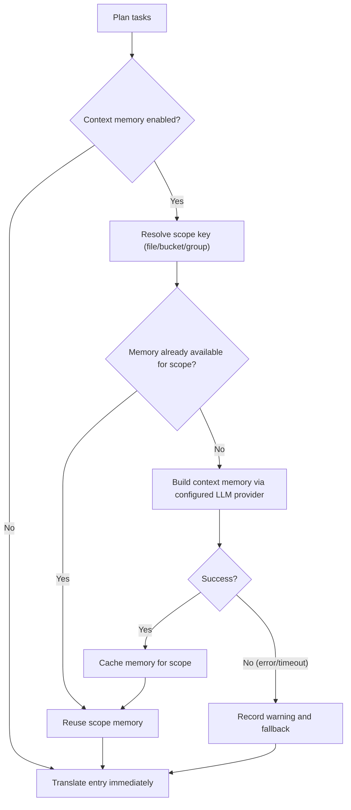

## Cách sử dụng

```bash
hyperlocalise run [--config <path>] [--group <name>] [--bucket <name>] [--file <path>] [--locale <locale>] [--dry-run] [--workers <count>] [--output <report.json>] [--experimental-context-memory] [--context-memory-scope <file|bucket|group>] [--context-memory-max-chars <count>]
```

## Hành vi

1. tải và xác thực cấu hình,
2. lập kế hoạch các nhiệm vụ từ các nhóm và các ngăn,
3. bỏ qua các tác vụ đã có trong `.hyperlocalise.lock.json`,
4. thực hiện các tác vụ còn lại,
5. lưu các tác vụ thành công vào trạng thái khóa.

Để biết các trường của lockfile, vòng đời và hướng dẫn đặt lại, xem [Hợp đồng lockfile](/reference/lockfile-contract).

## Các định dạng tệp cục bộ được hỗ trợ

`run` có thể đọc các tệp nguồn và đích với các phần mở rộng này:

- `.json`
- `.jsonc`
- `.yaml` và `.yml`
- `.js`, `.jsx`, `.mjs`, `.cjs`, `.ts`, `.tsx`, `.mts`, và `.cts`
- `.arb`
- `.xlf`, `.xlif` và `.xliff`
- `.po`
- `.html`
- `.liquid`
- `.md`
- `.mdx`
- `.strings`
- `.stringsdict`
- `.xcstrings`
- `.csv`
- `.php`
- `.ftl`
- các tệp Android XML `strings.xml` tại `**/res/values*/strings.xml`
- `.xml` và `.resx` cho các tệp ngôn ngữ XML chung
- `.properties`

Đối với JSON (`.json`), `run` hỗ trợ:

- các đối tượng JSON key/value lồng nhau tiêu chuẩn
- JSON thông điệp FormatJS khi gốc khớp chính xác:
  `{"[id]": {"defaultMessage": "[message]", "description": "[description]"}}`

Ở chế độ FormatJS, chỉ `defaultMessage` được dịch. Các khóa (message IDs), `description`, và các siêu dữ liệu không phải thông điệp khác được giữ nguyên.

Đối với các mô-đun locale JavaScript và TypeScript (`.js`, `.jsx`, `.mjs`, `.cjs`, `.ts`, `.tsx`, `.mts`, `.cts`), `run` hỗ trợ các export đối tượng locale tĩnh:

- `export default { ... }`
- `export const messages = { ... }`
- `module.exports = { ... }`
- `const messages = { ... }; export default messages`

Các đối tượng lồng nhau được làm phẳng thành các khóa có dấu chấm, các mảng chuỗi dùng chỉ số trong ngoặc vuông, và các mục nhập kiểu FormatJS nghiêm ngặt chỉ dịch `defaultMessage` trong khi vẫn giữ nguyên siêu dữ liệu `description`. Chú thích, lệnh import, cú pháp export, và `as const` được giữ nguyên khi ghi. Các giá trị động, khóa được tính toán, thuộc tính spread, nhiều đối tượng locale được export, và các template literal với phép nội suy `${...}` sẽ lỗi với lỗi phân tích cú pháp thay vì được viết lại.

Khi một mô-đun đích JS/TS hiện có có cùng tập khóa như nguồn, `run` ghi vào mẫu đích để giữ lại các chú thích của dịch giả và bố cục mô-đun hiện có. Nếu tập khóa của nguồn thay đổi, `run` sẽ quay về mẫu nguồn để tránh gộp các dạng đối tượng không khớp.

Đối với YAML/YML (`.yaml`, `.yml`), `run` hỗ trợ các tệp ngôn ngữ dạng ánh xạ với các lá là chuỗi. Các ánh xạ lồng nhau trở thành các khóa có dấu chấm, các dãy trở thành các khóa `[index]`, và ghi ngược sẽ viết lại các lá chuỗi hiện có trong khi vẫn giữ thứ tự/chú thích của khóa khi có thể. Các khóa ánh xạ không thể chứa `.`, `[`, hoặc `]` vì các ký tự đó được dành riêng cho các đường dẫn đã được làm phẳng. Các lá vô hướng không phải chuỗi như số, giá trị boolean, null, dấu thời gian, anchor và alias sẽ bị từ chối để tránh hỏng dữ liệu âm thầm.

Đối với Markdown và MDX (`.md`, `.mdx`), `run` dịch văn xuôi đã trích xuất và giữ nguyên cấu trúc không thể dịch:

Đối với HTML (`.html`), `run` dịch nội dung văn bản bên trong các phần tử cấp khối:

- `<script>`, `<style>`, `<pre>`, và nội dung `<head>` không bao giờ được dịch và được giữ nguyên nguyên văn
- các thẻ nội dòng trong các đoạn có thể dịch (`<strong>`, `<em>`, `<a>`, v.v.) — phần đánh dấu thẻ được bảo vệ như các phần giữ chỗ và được khôi phục nguyên văn sau khi dịch, nhưng phần văn xuôi xung quanh **được** dịch
- `` — giá trị thuộc tính `alt` được trích xuất như một đơn vị dịch riêng; phần còn lại của thẻ (src, class, v.v.) được giữ nguyên nguyên văn
- Các thực thể HTML (`&amp;`, `&lt;`, v.v.) được giữ nguyên như cũ trong suốt quá trình dịch qua lại
- Các chú thích HTML được giữ nguyên nguyên văn
- Các dấu phân cách đầu ra của Liquid (`{{ ... }}`) được bảo vệ như các placeholder và được khôi phục nguyên văn

Đối với Chuỗi Apple/Xcode (`.strings`), `run` bảo toàn các chú thích và định dạng khóa/giá trị từ mẫu trong khi thay thế các hằng số giá trị bằng văn bản đã dịch.

- bố cục khóa/giá trị (ví dụ: `key,value`)
- bố cục cột theo từng ngôn ngữ (ví dụ: `id,en,fr,de`)
- `--config`: đường dẫn đến tệp cấu hình (mặc định `i18n.yml`, dự phòng sang `i18n.jsonc`, trong thư mục hiện tại)
- `--group`: chỉ chạy các tác vụ cho tên nhóm đã cho
- `--bucket`: chỉ chạy các tác vụ cho tên bucket đã cho

Đối với Liquid (`.liquid`), `run` dịch các văn bản mẫu hiển thị được mã hóa cứng và giữ nguyên cú pháp Liquid:

- `--file`: chỉ chạy các tác vụ cho đường dẫn tệp nguồn đã cho (có thể lặp lại)
- `--locale`: chỉ chạy các tác vụ cho ngôn ngữ đích đã cho (có thể lặp lại); `--target-locale` là một bí danh
- `--dry-run`: chỉ in kế hoạch, không dịch hoặc ghi tệp
- `--force`: chạy lại tất cả các tác vụ đã lên kế hoạch và bỏ qua trạng thái bỏ qua của lockfile
- `--prune`: xóa các khóa đích không còn tồn tại trong các tệp nguồn

Việc thay đổi cấu trúc prompt (ví dụ: chuyển ngữ cảnh từ tin nhắn của người dùng sang tin nhắn hệ thống) không tự động làm vô hiệu các mục bộ nhớ đệm từ xa. Để buộc dịch lại sau khi tái cấu trúc prompt, hãy tăng `prompt_version` trong hồ sơ của bạn.

Đối với các mảng ngôn ngữ PHP (`.php`), `run` hỗ trợ các tệp chỉ gồm một thẻ mở PHP và một mảng trả về tĩnh duy nhất:

- `return [ ... ];` và `return array(...);` được hỗ trợ
- các khóa chuỗi được đặt trong dấu ngoặc kép được làm phẳng với các đường dẫn có dấu chấm, chẳng hạn như `auth.failed`
- giá trị chuỗi có thể dùng dấu nháy đơn hoặc nháy kép; chú thích, khoảng trắng, thứ tự khóa và cú pháp mảng được giữ nguyên khi ghi lại
- các mảng lồng nhau có thể mô hình hóa các biến thể số nhiều hoặc select với các khóa như `items.one` và `items.other`
- PHP thực thi, biến, lời gọi hàm, hằng số, `declare(...)`, và nội suy trong dấu ngoặc kép bị từ chối với một lỗi phân tích cú pháp rõ ràng

Ánh xạ cấu hình ví dụ:

```yaml
buckets:
  app:
    files:
      - from: resources/lang/en/messages.php
        to: resources/lang/{{target}}/messages.php
```

Đối với Apple/Xcode String Catalogs (`.xcstrings`), `run` đọc các mục trong danh mục từ `strings[*].localizations[sourceLanguage]` khi có sẵn, sẽ quay về khóa danh mục cho các mục đơn giản chỉ có nguồn, và ghi các giá trị đã dịch dưới `localizations[targetLocale]`. Các nhánh plural, device và substitution được hiển thị dưới dạng các khóa ổn định như `item_count::plural.one`, `search_label::device.mac`, và `count_label::substitution.total::plural.other`. Đầu ra được chuẩn hóa thành JSON xác định; các chú thích, trạng thái trích xuất, trạng thái string-unit và siêu dữ liệu danh mục không liên quan được giữ nguyên dưới dạng các trường JSON, nhưng khoảng trắng gốc và thứ tự đối tượng thì không được bảo toàn theo từng byte.

Đối với tài nguyên chuỗi XML Android (`**/res/values*/strings.xml`), `run` được dịch:

- `<string name="...">` giá trị
- `<plurals name="..."><item quantity="...">` các giá trị, sử dụng các khóa như `item_count.one` và `item_count.other`

Các chú thích Android, namespace và thuộc tính tài nguyên như `formatted`, `tools:*` và `translatable` được giữ nguyên. Các tài nguyên được đánh dấu `translatable="false"` sẽ bị bỏ qua. Các phần giữ chỗ Android như `%1$s` và `%d` vẫn nằm trong văn bản trích xuất và sẽ được ghi lại với giá trị đã dịch.

Các hình dạng tài nguyên Android có thể dịch không được hỗ trợ như `<string-array>` sẽ báo lỗi phân tích cú pháp rõ ràng thay vì bị bỏ qua.


Đối với các thuộc tính Java (`.properties`), `run` hỗ trợ các resource bundle dạng key/value theo từng ngôn ngữ như `messages_en.properties` -> `messages_[locale].properties`. Nó phân tích các dấu phân tách kiểu Java (`=`, `:`, hoặc khoảng trắng), các key và giá trị đã thoát, các mã thoát Unicode `\uXXXX`, và các phần nối dòng. Các chú thích bắt đầu bằng `#` hoặc `!` được giữ nguyên và các chú thích liền kề có thể được dùng làm ngữ cảnh cho mục nhập. Khi ghi, thứ tự key hiện có, chú thích, dấu phân tách và khoảng cách được giữ nguyên; các giá trị đã dịch được chuẩn hóa thành giá trị đã thoát trên một dòng. Các key trùng lặp, các mã thoát Unicode không hợp lệ, đầu vào UTF-8 không hợp lệ và các phần nối dang dở sẽ gây lỗi phân tích rõ ràng.

Để khắc phục sự cố hiển thị tiến trình, bạn có thể bật nhật ký gỡ lỗi mà không cần thay đổi cờ CLI:

- `HYPERLOCALISE_PROGRESS_DEBUG=1` bật ghi nhật ký gỡ lỗi tiến trình.
- `HYPERLOCALISE_PROGRESS_DEBUG_FILE=<path>` ghi đè vị trí tệp nhật ký.

Đường dẫn nhật ký mặc định khi được bật: `.hyperlocalise/logs/run.log`.

Đối với Mozilla Fluent (`.ftl`), `run` hỗ trợ các thông điệp cấp cao nhất, thuộc tính thông điệp, giá trị nhiều dòng và các mẫu select/plural được biểu diễn dưới dạng giá trị thông điệp đầy đủ:

- các thuộc tính được hiển thị dưới dạng các khóa có dấu chấm như `brand.title`
- các bình luận, dòng trống và siêu dữ liệu chưa được phân tích cú pháp được giữ nguyên khi các giá trị được thay thế trong một mẫu hiện có
- Các thuật ngữ Fluent (`-brand = ...`) và tham chiếu thuật ngữ không được hỗ trợ và sẽ thất bại với một lỗi phân tích cú pháp rõ ràng
- các khóa thông điệp mới được thêm vào được sắp xếp theo cách xác định; các thuộc tính mới chỉ có thể được thêm vào khi thông điệp cha của chúng chưa có sẵn trong mẫu

Đối với XML tổng quát (`.xml`, `.resx`), `run` dịch các phần tử lá chỉ chứa văn bản và giữ nguyên cấu trúc XML không liên quan:

- lá có khóa sử dụng các thuộc tính `key`, `id`, hoặc `name`, ví dụ `<message key="checkout.cta">Checkout now</message>`
- các lá có dạng đường dẫn lồng nhau sử dụng các đường dẫn phần tử dạng chấm, ví dụ `<home><title>Welcome</title></home>` -> `home.title`
- các mục kiểu `.resx`-style `<data name="home.title"><value>Welcome</value></data>` được hỗ trợ
- các nhận xét, thuộc tính, các phần tử metadata như `<metadata>`, `<comment>` và `<resheader>` được giữ nguyên
- các giá trị nội dung hỗn hợp như `Hello <ph/>` và các tệp Android `<resources>` bị từ chối thay vì được viết lại thành XML chung

## Luồng bộ nhớ ngữ cảnh thử nghiệm

- Mục nhập đầu tiên trong một phạm vi mới sẽ chờ quá trình tạo bộ nhớ hoàn tất.
- Các mục nhập sau trong cùng phạm vi sẽ tái sử dụng bộ nhớ phạm vi hiện có và tiếp tục mà không cần xây dựng lại.
- Giao diện tiến độ hiện hiển thị các bước bộ nhớ ngữ cảnh trong danh sách tệp để bạn có thể thấy công việc đang hoạt động ở cấp phạm vi.
- `system_prompt` được dùng cho hướng dẫn và ngữ cảnh lúc chạy.
- `user_prompt` được dùng cho nội dung payload (văn bản cần dịch, hoặc nội dung nguồn để tóm tắt cho bộ nhớ ngữ cảnh).
- Luồng dịch hỗ trợ ghi đè hồ sơ `user_prompt`.
- Luồng tóm tắt bộ nhớ ngữ cảnh luôn sử dụng mẫu tải trọng tóm tắt tích hợp sẵn và không áp dụng ghi đè `user_prompt` của hồ sơ.
- `--context-memory-max-chars`: độ dài bộ nhớ ngữ cảnh tối đa được chèn vào mỗi yêu cầu dịch (mặc định `1200`)
- `--context-memory-scope`: phạm vi chia sẻ ngữ cảnh (`file|bucket|group`, `file` mặc định)
- `--experimental-context-memory`: bật tạo bộ nhớ ngữ cảnh hai giai đoạn trước khi dịch từng phạm vi
- [eval](/commands/eval)
- [trạng thái](/commands/status)
- [sync đẩy](/commands/sync-push)
- [sync pull](/commands/sync-pull)
- [Hợp đồng lockfile](/reference/lockfile-contract)
- `--output`: ghi báo cáo chạy JSON có thể đọc bằng máy vào đường dẫn đã cho

## Phạm vi áp dụng cho một nhóm

- `--progress`: chế độ hiển thị tiến trình (`auto|on|off`, mặc định: `auto`)
- `--workers`: số lượng worker dịch song song (mặc định là số lõi CPU)
- `--prune-force`: bỏ qua giới hạn an toàn xóa prune
- `--prune-max-deletions`: số khóa cũ tối đa bị xóa trong một lần chạy trước khi yêu cầu ghi đè rõ ràng (mặc định `100`)

<Note>
Nếu việc tạo bộ nhớ thất bại hoặc hết thời gian chờ, `run` sẽ ghi cảnh báo và tiếp tục dịch mà không dùng bộ nhớ chia sẻ cho phạm vi đó.
</Note>

### Tại sao nó có thể có vẻ như đang chờ

Sử dụng `--group` khi bạn muốn chỉ chạy một nhóm đã được cấu hình.

- Các mẫu Liquid dạng HTML sử dụng cùng hành vi trích xuất văn bản hiển thị như HTML
- ``, ``, ``, `` và `` các khối được giữ nguyên nguyên văn

Nếu nhóm không tồn tại trong cấu hình của bạn, `run` sẽ thất bại với lỗi lập kế hoạch `unknown group`.

## Phạm vi áp dụng cho một bucket

Dùng `--bucket` khi bạn muốn chỉ chạy một bucket đã được cấu hình. Điều này hữu ích cho các bản cập nhật tập trung, chia phần CI hoặc xác thực một khu vực duy nhất trước khi chạy đầy đủ.

Nếu bucket không tồn tại trong cấu hình của bạn, `run` sẽ gặp lỗi lập kế hoạch `unknown bucket`.



### Ghi nhật ký gỡ lỗi tiến trình (tùy chọn)

- Các lệnh gọi khóa ngôn ngữ Shopify như `{{ 'header.title' | t }}` được giữ nguyên như cấu trúc mẫu, không được dịch như văn bản nguồn
- Các thẻ Liquid độc lập (``) hoạt động như ranh giới của mẫu; các thẻ bên trong thuộc tính HTML được bảo vệ nội tuyến và được khôi phục nguyên văn
- Thẻ thành phần JSX/MDX và giá trị thuộc tính


## Phạm vi áp dụng cho một tệp nguồn

Sử dụng `--file` khi bạn muốn chỉ chạy một tệp nguồn đã được cấu hình. Bạn có thể lặp lại cờ này để chọn nhiều tệp nguồn, và bạn có thể kết hợp nó với `--group`, `--bucket`, và `--locale`.

```bash
hyperlocalise run --group tests --dry-run
```

Nếu tệp không thuộc các ánh xạ nguồn đã cấu hình, `run` sẽ thất bại với lỗi lập kế hoạch `unknown source file`.

## Phạm vi áp dụng cho một ngôn ngữ bản địa đích

Dùng `--locale` khi bạn muốn chỉ chạy lại các ngôn ngữ cụ thể mà không thay đổi lựa chọn nhóm hoặc bucket. Bạn có thể lặp lại cờ này để chọn nhiều ngôn ngữ. Bộ lọc này cũng có sẵn dưới dạng `--target-locale` để tương thích với các script cũ hơn.

```bash
hyperlocalise run --bucket ui --dry-run
```

Nếu một ngôn ngữ được yêu cầu không có trong `locales.targets`, `run` sẽ thất bại với lỗi lập kế hoạch `unknown target locale`. Khi kết hợp với `--group`, chỉ những ngôn ngữ thuộc nhóm đó mới được lập kế hoạch.

## Buộc chạy lại tất cả các tác vụ đã lên kế hoạch

Khi được kết hợp với `--prune`, việc phát hiện khóa cũ cũng chỉ giới hạn ở các ngôn ngữ đích đã chọn. `run` chỉ quét và loại bỏ các tệp đích thuộc tập ngôn ngữ đã được lọc.

```bash
hyperlocalise run --file content/en/checkout.json --dry-run
```

Sử dụng `--force` để bỏ qua trạng thái bỏ qua của lockfile và thực thi lại mọi tác vụ đã lên kế hoạch.

## Các trường đầu ra

Việc sử dụng token theo từng ngôn ngữ được in như sau: `locale_usage locale=<locale> prompt_tokens=<...> completion_tokens=<...> total_tokens=<...>`.

```bash
hyperlocalise run --group tests --locale fr --locale de --dry-run
```

Khi bạn chuyển `--output`, báo cáo JSON bao gồm siêu dữ liệu chạy (`generatedAt`, `configPath`), tổng mức sử dụng token, mức sử dụng theo từng ngôn ngữ, và mức sử dụng theo từng lô cho mỗi mục.

Khi tác vụ thất bại, đầu ra bao gồm `failure target=<...> key=<...> reason=<...>`.

```bash
hyperlocalise run --prune --locale de --dry-run
```

## Đầu ra lỗi

Giảm `--workers` khi bạn chạm vào giới hạn tốc độ của nhà cung cấp hoặc chạy trong các môi trường CI bị hạn chế. Bắt đầu với `1` để ổn định các lần thử lại, rồi tăng dần.

```bash
hyperlocalise run --group tests --force
```

## Hướng dẫn tinh chỉnh worker

- `planned_total`
- `skipped_by_lock`
- `executable_total`
- `succeeded`
- `failed`
- `persisted_to_lock`
- `prompt_tokens`
- `completion_tokens`
- `total_tokens`

Tăng `--workers` khi hạn mức nhà cung cấp và tài nguyên máy của bạn cho phép thông lượng cao hơn. Hãy tăng từng bước nhỏ và theo dõi tỷ lệ lỗi API cùng mức sử dụng CPU và bộ nhớ cục bộ.

Khi `--experimental-context-memory` được bật, `run` sẽ tạo bộ nhớ dùng chung một lần cho mỗi phạm vi (mặc định: mỗi tệp nguồn), rồi tái sử dụng cho tất cả các mục trong phạm vi đó.

## Xem thêm

Khi ghi các đích CSV, `run` giữ nguyên tiêu đề hiện có và các cột không phải đích, cập nhật các khóa khớp tại chỗ, và thêm các khóa mới theo thứ tự sắp xếp xác định.


## Hợp đồng prompt cho `run`

Đối với CSV (`.csv`), `run` hỗ trợ hai bố cục:

Đối với Flutter ARB (`.arb`), `run` chỉ dịch các khóa thông điệp, giữ nguyên các khóa siêu dữ liệu như `@key`, và chuẩn hóa `@@locale` sang ngôn ngữ đích khi ghi.

## Cờ

- Dòng `import` và `export`
- Các anchor Markdown như đích liên kết
- các đoạn mã nội tuyến
- khối mã được bao bởi dấu gạch ngang (```` ``` ```` và `~~~`)
- các khối frontmatter (`---`)
