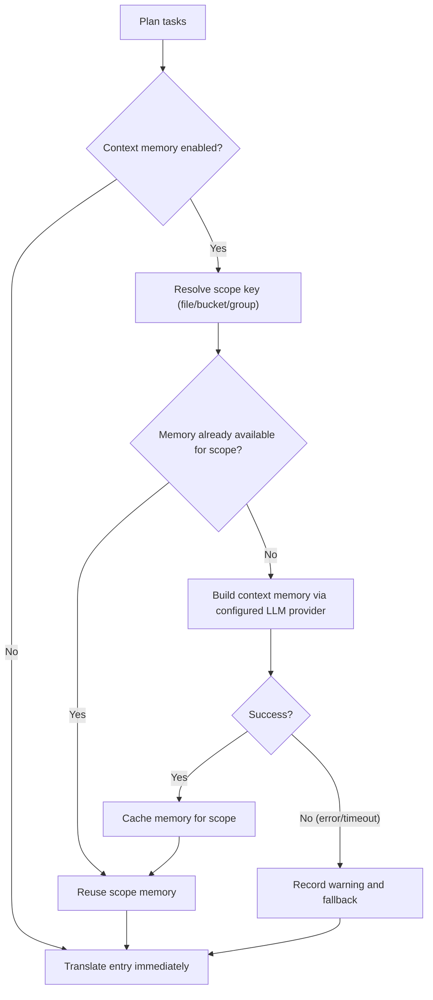

## Cách sử dụng

```bash
hyperlocalise run [--config <path>] [--group <name>] [--bucket <name>] [--file <path>] [--locale <locale>] [--dry-run] [--workers <count>] [--output <report.json>] [--experimental-context-memory] [--context-memory-scope <file|bucket|group>] [--context-memory-max-chars <count>]
```

## Hành vi

1. tải và xác thực cấu hình,
2. lập kế hoạch các nhiệm vụ từ các nhóm và các ngăn,
3. bỏ qua các tác vụ đã có trong `.hyperlocalise.lock.json`,
4. thực hiện các tác vụ còn lại,
5. lưu các tác vụ thành công vào trạng thái khóa.

Để biết các trường của lockfile, vòng đời và hướng dẫn đặt lại, xem [Hợp đồng lockfile](/reference/lockfile-contract).

## Các định dạng tệp cục bộ được hỗ trợ

`run` có thể đọc các tệp nguồn và đích với các phần mở rộng này:

- `.json`
- `.arb`
- `.xlf` và `.xliff`
- `.po`
- `.html`
- `.liquid`
- `.md`
- `.mdx`
- `.strings`
- `.stringsdict`
- `.xcstrings`
- `.csv`
- `.ftl`

Đối với JSON (`.json`), `run` hỗ trợ:

- các đối tượng JSON key/value lồng nhau tiêu chuẩn
- JSON thông điệp FormatJS khi gốc khớp chính xác:
  `{"[id]": {"defaultMessage": "[message]", "description": "[description]"}}`

Ở chế độ FormatJS, chỉ `defaultMessage` được dịch. Các khóa (message IDs), `description`, và các siêu dữ liệu không phải thông điệp khác được giữ nguyên.

Đối với Flutter ARB (`.arb`), `run` chỉ dịch các khóa thông điệp, giữ nguyên các khóa siêu dữ liệu như `@key`, và chuẩn hóa `@@locale` sang ngôn ngữ đích khi ghi.

Đối với Markdown và MDX (`.md`, `.mdx`), `run` dịch văn xuôi đã trích xuất và giữ nguyên cấu trúc không thể dịch:

- các khối frontmatter (`---`)
- khối mã được bao bởi dấu gạch ngang (```` ``` ```` và `~~~`)
- các đoạn mã nội tuyến
- Các anchor Markdown như đích liên kết
- Dòng `import` và `export`
- Thẻ thành phần JSX/MDX và giá trị thuộc tính

Đối với HTML (`.html`), `run` dịch nội dung văn bản bên trong các phần tử cấp khối:

- `<script>`, `<style>`, `<pre>`, và nội dung `<head>` không bao giờ được dịch và được giữ nguyên nguyên văn
- các thẻ nội dòng trong các đoạn có thể dịch (`<strong>`, `<em>`, `<a>`, v.v.) — phần đánh dấu thẻ được bảo vệ như các phần giữ chỗ và được khôi phục nguyên văn sau khi dịch, nhưng phần văn xuôi xung quanh **được** dịch
- `` — giá trị thuộc tính `alt` được trích xuất như một đơn vị dịch riêng; phần còn lại của thẻ (src, class, v.v.) được giữ nguyên nguyên văn
- Các thực thể HTML (`&amp;`, `&lt;`, v.v.) được giữ nguyên như cũ trong suốt quá trình dịch qua lại
- Các chú thích HTML được giữ nguyên nguyên văn

Đối với Liquid (`.liquid`), `run` dịch các văn bản mẫu hiển thị được mã hóa cứng và giữ nguyên cú pháp Liquid:

- Các dấu phân cách đầu ra của Liquid (`{{ ... }}`) được bảo vệ như các placeholder và được khôi phục nguyên văn
- Các thẻ Liquid độc lập (``) hoạt động như ranh giới của mẫu; các thẻ bên trong thuộc tính HTML được bảo vệ nội tuyến và được khôi phục nguyên văn
- Các lệnh gọi khóa ngôn ngữ Shopify như `{{ 'header.title' | t }}` được giữ nguyên như cấu trúc mẫu, không được dịch như văn bản nguồn
- ``, ``, ``, `` và `` các khối được giữ nguyên nguyên văn
- Các mẫu Liquid dạng HTML sử dụng cùng hành vi trích xuất văn bản hiển thị như HTML

Đối với Chuỗi Apple/Xcode (`.strings`), `run` bảo toàn các chú thích và định dạng khóa/giá trị từ mẫu trong khi thay thế các hằng số giá trị bằng văn bản đã dịch.


Đối với CSV (`.csv`), `run` hỗ trợ hai bố cục:

- bố cục khóa/giá trị (ví dụ: `key,value`)
- bố cục cột theo từng ngôn ngữ (ví dụ: `id,en,fr,de`)

Khi ghi các đích CSV, `run` giữ nguyên tiêu đề hiện có và các cột không phải đích, cập nhật các khóa khớp tại chỗ, và thêm các khóa mới theo thứ tự sắp xếp xác định.

## Cờ

- `--config`: đường dẫn đến tệp cấu hình (mặc định `i18n.yml`, dự phòng sang `i18n.jsonc`, trong thư mục hiện tại)
- `--group`: chỉ chạy các tác vụ cho tên nhóm đã cho
- `--bucket`: chỉ chạy các tác vụ cho tên bucket đã cho
- `--file`: chỉ chạy các tác vụ cho đường dẫn tệp nguồn đã cho (có thể lặp lại)
- `--locale`: chỉ chạy các tác vụ cho ngôn ngữ đích đã cho (có thể lặp lại); `--target-locale` là một bí danh
- `--dry-run`: chỉ in kế hoạch, không dịch hoặc ghi tệp
- `--force`: chạy lại tất cả các tác vụ đã lên kế hoạch và bỏ qua trạng thái bỏ qua của lockfile
- `--prune`: xóa các khóa đích không còn tồn tại trong các tệp nguồn
- `--prune-max-deletions`: số khóa cũ tối đa bị xóa trong một lần chạy trước khi yêu cầu ghi đè rõ ràng (mặc định `100`)
- `--prune-force`: bỏ qua giới hạn an toàn xóa prune
- `--workers`: số lượng worker dịch song song (mặc định là số lõi CPU)
- `--progress`: chế độ hiển thị tiến trình (`auto|on|off`, mặc định: `auto`)
- `--output`: ghi báo cáo chạy JSON có thể đọc bằng máy vào đường dẫn đã cho
- `--experimental-context-memory`: bật tạo bộ nhớ ngữ cảnh hai giai đoạn trước khi dịch từng phạm vi
- `--context-memory-scope`: phạm vi chia sẻ ngữ cảnh (`file|bucket|group`, `file` mặc định)
- `--context-memory-max-chars`: độ dài bộ nhớ ngữ cảnh tối đa được chèn vào mỗi yêu cầu dịch (mặc định `1200`)

## Hợp đồng prompt cho `run`

- `system_prompt` được dùng cho hướng dẫn và ngữ cảnh lúc chạy.
- `user_prompt` được dùng cho nội dung payload (văn bản cần dịch, hoặc nội dung nguồn để tóm tắt cho bộ nhớ ngữ cảnh).
- Luồng dịch hỗ trợ ghi đè hồ sơ `user_prompt`.
- Luồng tóm tắt bộ nhớ ngữ cảnh luôn sử dụng mẫu tải trọng tóm tắt tích hợp sẵn và không áp dụng ghi đè `user_prompt` của hồ sơ.

<Note>
Việc thay đổi cấu trúc prompt (ví dụ: chuyển ngữ cảnh từ tin nhắn của người dùng sang tin nhắn hệ thống) không tự động làm vô hiệu các mục bộ nhớ đệm từ xa. Để buộc dịch lại sau khi tái cấu trúc prompt, hãy tăng `prompt_version` trong hồ sơ của bạn.
</Note>

### Ghi nhật ký gỡ lỗi tiến trình (tùy chọn)

Để khắc phục sự cố hiển thị tiến trình, bạn có thể bật nhật ký gỡ lỗi mà không cần thay đổi cờ CLI:

- `HYPERLOCALISE_PROGRESS_DEBUG=1` bật ghi nhật ký gỡ lỗi tiến trình.
- `HYPERLOCALISE_PROGRESS_DEBUG_FILE=<path>` ghi đè vị trí tệp nhật ký.

Đường dẫn nhật ký mặc định khi được bật: `.hyperlocalise/logs/run.log`.

## Luồng bộ nhớ ngữ cảnh thử nghiệm

Khi `--experimental-context-memory` được bật, `run` sẽ tạo bộ nhớ dùng chung một lần cho mỗi phạm vi (mặc định: mỗi tệp nguồn), rồi tái sử dụng cho tất cả các mục trong phạm vi đó.

Nếu việc tạo bộ nhớ thất bại hoặc hết thời gian chờ, `run` sẽ ghi cảnh báo và tiếp tục dịch mà không dùng bộ nhớ chia sẻ cho phạm vi đó.



### Tại sao nó có thể có vẻ như đang chờ

- Mục nhập đầu tiên trong một phạm vi mới sẽ chờ quá trình tạo bộ nhớ hoàn tất.
- Các mục nhập sau trong cùng phạm vi sẽ tái sử dụng bộ nhớ phạm vi hiện có và tiếp tục mà không cần xây dựng lại.
- Giao diện tiến độ hiện hiển thị các bước bộ nhớ ngữ cảnh trong danh sách tệp để bạn có thể thấy công việc đang hoạt động ở cấp phạm vi.


## Phạm vi áp dụng cho một nhóm

Sử dụng `--group` khi bạn muốn chỉ chạy một nhóm đã được cấu hình.

```bash
hyperlocalise run --group tests --dry-run
```

Nếu nhóm không tồn tại trong cấu hình của bạn, `run` sẽ thất bại với lỗi lập kế hoạch `unknown group`.

## Phạm vi áp dụng cho một bucket

Dùng `--bucket` khi bạn muốn chỉ chạy một bucket đã được cấu hình. Điều này hữu ích cho các bản cập nhật tập trung, chia phần CI hoặc xác thực một khu vực duy nhất trước khi chạy đầy đủ.

```bash
hyperlocalise run --bucket ui --dry-run
```

Nếu bucket không tồn tại trong cấu hình của bạn, `run` sẽ gặp lỗi lập kế hoạch `unknown bucket`.

## Phạm vi áp dụng cho một tệp nguồn

Sử dụng `--file` khi bạn muốn chỉ chạy một tệp nguồn đã được cấu hình. Bạn có thể lặp lại cờ này để chọn nhiều tệp nguồn, và bạn có thể kết hợp nó với `--group`, `--bucket`, và `--locale`.

```bash
hyperlocalise run --file content/en/checkout.json --dry-run
```

Nếu tệp không thuộc các ánh xạ nguồn đã cấu hình, `run` sẽ thất bại với lỗi lập kế hoạch `unknown source file`.

## Phạm vi áp dụng cho một ngôn ngữ bản địa đích

Dùng `--locale` khi bạn muốn chỉ chạy lại các ngôn ngữ cụ thể mà không thay đổi lựa chọn nhóm hoặc bucket. Bạn có thể lặp lại cờ này để chọn nhiều ngôn ngữ. Bộ lọc này cũng có sẵn dưới dạng `--target-locale` để tương thích với các script cũ hơn.

```bash
hyperlocalise run --group tests --locale fr --locale de --dry-run
```

Nếu một ngôn ngữ được yêu cầu không có trong `locales.targets`, `run` sẽ thất bại với lỗi lập kế hoạch `unknown target locale`. Khi kết hợp với `--group`, chỉ những ngôn ngữ thuộc nhóm đó mới được lập kế hoạch.

Khi được kết hợp với `--prune`, việc phát hiện khóa cũ cũng chỉ giới hạn ở các ngôn ngữ đích đã chọn. `run` chỉ quét và loại bỏ các tệp đích thuộc tập ngôn ngữ đã được lọc.

```bash
hyperlocalise run --prune --locale de --dry-run
```

## Buộc chạy lại tất cả các tác vụ đã lên kế hoạch

Sử dụng `--force` để bỏ qua trạng thái bỏ qua của lockfile và thực thi lại mọi tác vụ đã lên kế hoạch.

```bash
hyperlocalise run --group tests --force
```

## Các trường đầu ra

- `planned_total`
- `skipped_by_lock`
- `executable_total`
- `succeeded`
- `failed`
- `persisted_to_lock`
- `prompt_tokens`
- `completion_tokens`
- `total_tokens`

Việc sử dụng token theo từng ngôn ngữ được in như sau: `locale_usage locale=<locale> prompt_tokens=<...> completion_tokens=<...> total_tokens=<...>`.

Khi bạn chuyển `--output`, báo cáo JSON bao gồm siêu dữ liệu chạy (`generatedAt`, `configPath`), tổng mức sử dụng token, mức sử dụng theo từng ngôn ngữ, và mức sử dụng theo từng lô cho mỗi mục.

## Đầu ra lỗi

Khi tác vụ thất bại, đầu ra bao gồm `failure target=<...> key=<...> reason=<...>`.


## Hướng dẫn tinh chỉnh worker

Giảm `--workers` khi bạn chạm vào giới hạn tốc độ của nhà cung cấp hoặc chạy trong các môi trường CI bị hạn chế. Bắt đầu với `1` để ổn định các lần thử lại, rồi tăng dần.

Tăng `--workers` khi hạn mức nhà cung cấp và tài nguyên máy của bạn cho phép thông lượng cao hơn. Hãy tăng từng bước nhỏ và theo dõi tỷ lệ lỗi API cùng mức sử dụng CPU và bộ nhớ cục bộ.

## Xem thêm

- [eval](/commands/eval)
- [trạng thái](/commands/status)
- [sync đẩy](/commands/sync-push)
- [sync pull](/commands/sync-pull)
- [Hợp đồng lockfile](/reference/lockfile-contract)
