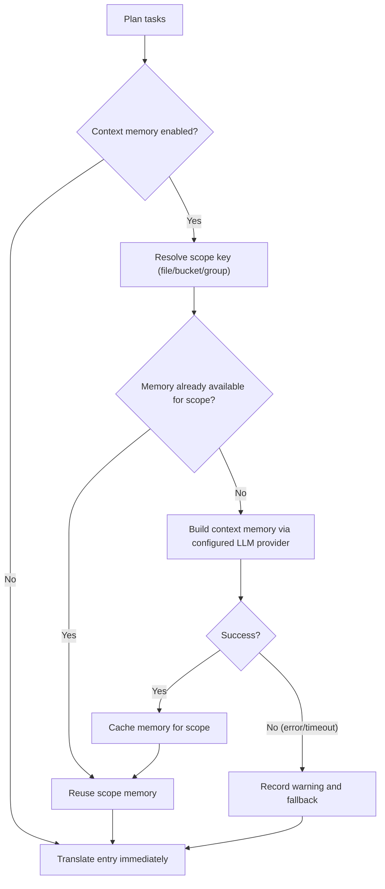

## Cách sử dụng

```bash
hyperlocalise run [--config <path>] [--group <name>] [--bucket <name>] [--locale <locale>] [--dry-run] [--workers <count>] [--output <report.json>] [--experimental-context-memory] [--context-memory-scope <file|bucket|group>] [--context-memory-max-chars <count>]
```

## Hành vi

1. tải và xác thực cấu hình,
2. lập kế hoạch công việc từ các nhóm và bucket,
3. bỏ qua các tác vụ đã có trong `.hyperlocalise.lock.json`,
4. thực hiện các nhiệm vụ còn lại,
5. duy trì các tác vụ thành công để khóa trạng thái.

Đối với các trường lockfile, vòng đời và hướng dẫn đặt lại, xem [Hợp đồng lockfile](/reference/lockfile-contract).

## Các định dạng tệp cục bộ được hỗ trợ

`run` có thể đọc các tệp nguồn và tệp đích với các phần mở rộng này:

- `.json`
- `.arb`
- `.xlf` và `.xliff`
- `.po`
- `.html`
- `.md`
- `.mdx`
- `.strings`
- `.stringsdict`
- `.csv`

Đối với JSON (`.json`), `run` hỗ trợ:

- các đối tượng JSON khóa/giá trị lồng nhau tiêu chuẩn
- JSON thông báo FormatJS khi phần gốc khớp chính xác:
  `{"[id]": {"defaultMessage": "[message]", "description": "[description]"}}`

Trong chế độ FormatJS, chỉ `defaultMessage` được dịch. Các khóa (message ID), `description`, và các siêu dữ liệu khác không phải thông điệp được giữ nguyên.

Đối với Flutter ARB (`.arb`), `run` chỉ dịch các khóa thông điệp, giữ nguyên các khóa siêu dữ liệu như `@key`, và chuẩn hóa `@@locale` sang ngôn ngữ đích khi ghi.

Đối với Markdown và MDX (`.md`, `.mdx`), `run` dịch phần văn xuôi đã trích xuất và bảo toàn cấu trúc không thể dịch:

- khối frontmatter (`---`)
- khối mã được đóng khung (```` ``` ```` và `~~~`)
- các đoạn mã nội tuyến
- Các neo Markdown như đích liên kết
- MDX `import` và `export` dòng
- Thẻ thành phần JSX/MDX và các giá trị thuộc tính

Đối với HTML (`.html`), `run` dịch nội dung văn bản bên trong các phần tử cấp khối:

- `<script>`, `<style>`, `<pre>` và nội dung `<head>` không bao giờ được dịch và được giữ nguyên nguyên văn
- thẻ nội dòng trong các đoạn có thể dịch (`<strong>`, `<em>`, `<a>`, v.v.) — đánh dấu thẻ được bảo vệ dưới dạng placeholder và được khôi phục nguyên văn sau khi dịch, nhưng phần văn xuôi xung quanh **được** dịch
- `` — giá trị thuộc tính `alt` được trích xuất thành một đơn vị dịch riêng; phần còn lại của thẻ (src, class, v.v.) được giữ nguyên nguyên văn
- Các thực thể HTML (`&amp;`, `&lt;`, v.v.) được giữ nguyên trong suốt quá trình dịch qua lại
- Chú thích HTML được giữ nguyên nguyên văn

Đối với Chuỗi Apple/Xcode (`.strings`), `run` giữ nguyên các chú thích và định dạng khóa/giá trị từ mẫu trong khi thay thế các giá trị nguyên văn bằng văn bản đã dịch.


Đối với CSV (`.csv`), `run` hỗ trợ hai bố cục:

- bố cục khóa/giá trị (ví dụ: `key,value`)
- bố cục cột theo từng ngôn ngữ (ví dụ: `id,en,fr,de`)

Khi ghi các đích CSV, `run` giữ nguyên tiêu đề hiện có và các cột không phải đích, cập nhật các khóa khớp ngay tại chỗ và nối thêm các khóa mới theo thứ tự sắp xếp xác định.

## Cờ

- `--config`: đường dẫn đến tệp cấu hình (mặc định `i18n.yml`, sẽ quay về `i18n.jsonc`, trong thư mục hiện tại)
- `--group`: chỉ chạy các tác vụ cho tên nhóm đã cho
- `--bucket`: chỉ chạy các tác vụ cho tên bucket đã cho
- `--locale`: chỉ chạy các tác vụ cho ngôn ngữ đích đã cho (có thể lặp lại); `--target-locale` là bí danh
- `--dry-run`: chỉ in kế hoạch, không dịch hoặc ghi tệp
- `--force`: chạy lại tất cả các tác vụ đã lên kế hoạch và bỏ qua trạng thái bỏ qua của lockfile
- `--prune`: xóa các khóa đích không còn tồn tại trong tệp nguồn
- `--prune-max-deletions`: số khóa lỗi thời tối đa được xóa trong một lần chạy trước khi yêu cầu ghi đè rõ ràng (mặc định `100`)
- `--prune-force`: bỏ qua giới hạn an toàn xóa prune
- `--workers`: số lượng worker dịch song song (mặc định là số lõi CPU)
- `--progress`: chế độ hiển thị tiến trình (`auto|on|off`, mặc định: `auto`)
- `--output`: ghi báo cáo chạy JSON có thể đọc bằng máy vào đường dẫn đã cho
- `--experimental-context-memory`: bật tạo bộ nhớ ngữ cảnh hai giai đoạn trước khi dịch mỗi phạm vi
- `--context-memory-scope`: phạm vi chia sẻ ngữ cảnh (`file|bucket|group`, `file` mặc định)
- `--context-memory-max-chars`: độ dài bộ nhớ ngữ cảnh tối đa được chèn vào mỗi yêu cầu dịch (mặc định `1200`)

## Thỏa thuận lời nhắc cho `run`

- `system_prompt` được dùng cho hướng dẫn và ngữ cảnh thời gian chạy.
- `user_prompt` được dùng cho nội dung payload (văn bản cần dịch, hoặc nội dung nguồn để tóm tắt cho bộ nhớ ngữ cảnh).
- Luồng dịch hỗ trợ ghi đè hồ sơ `user_prompt`.
- Luồng tóm tắt bộ nhớ ngữ cảnh luôn sử dụng mẫu payload tóm tắt tích hợp sẵn và không áp dụng ghi đè `user_prompt` của hồ sơ.

<Note>
Việc thay đổi cấu trúc prompt (ví dụ: chuyển ngữ cảnh từ tin nhắn của người dùng sang tin nhắn hệ thống) không tự động làm mất hiệu lực các mục trong bộ nhớ đệm từ xa. Để buộc dịch lại sau khi tái cấu trúc prompt, hãy tăng `prompt_version` trong hồ sơ của bạn.
</Note>

### Ghi nhật ký gỡ lỗi tiến trình (tùy chọn)

Để khắc phục sự cố hiển thị tiến trình, bạn có thể bật nhật ký gỡ lỗi mà không cần thay đổi cờ CLI:

- `HYPERLOCALISE_PROGRESS_DEBUG=1` cho phép ghi nhật ký gỡ lỗi tiến trình.
- `HYPERLOCALISE_PROGRESS_DEBUG_FILE=<path>` ghi đè vị trí tệp nhật ký.

Đường dẫn nhật ký mặc định khi được bật: `.hyperlocalise/logs/run.log`.

## Luồng bộ nhớ ngữ cảnh thử nghiệm

Khi `--experimental-context-memory` được bật, `run` sẽ tạo bộ nhớ dùng chung một lần cho mỗi phạm vi (mặc định: mỗi tệp nguồn), rồi tái sử dụng nó cho tất cả các mục trong phạm vi đó.

Nếu quá trình tạo bộ nhớ thất bại hoặc hết thời gian chờ, `run` sẽ ghi một cảnh báo và tiếp tục dịch mà không dùng bộ nhớ dùng chung cho phạm vi đó.



### Tại sao nó có thể dường như đang chờ đợi

- Mục nhập đầu tiên trong một phạm vi mới sẽ đợi quá trình tạo bộ nhớ hoàn tất.
- Các mục nhập sau đó trong cùng phạm vi sẽ tái sử dụng bộ nhớ hiện có của phạm vi và tiếp tục mà không cần xây dựng lại.
- Giao diện tiến trình giờ hiển thị các bước bộ nhớ ngữ cảnh trong danh sách tệp để bạn có thể xem công việc đang hoạt động ở cấp phạm vi.


## Phạm vi áp dụng cho một nhóm

Sử dụng `--group` khi bạn muốn chỉ chạy một nhóm đã được cấu hình.

```bash
hyperlocalise run --group tests --dry-run
```

Nếu nhóm không tồn tại trong cấu hình của bạn, `run` sẽ thất bại với lỗi lập kế hoạch `unknown group`.

## Phạm vi áp dụng cho một bucket

Sử dụng `--bucket` khi bạn chỉ muốn chạy một bucket đã cấu hình. Điều này hữu ích cho các bản cập nhật tập trung, phân chia CI, hoặc xác thực một khu vực duy nhất trước khi chạy toàn bộ.

```bash
hyperlocalise run --bucket ui --dry-run
```

Nếu bucket không tồn tại trong cấu hình của bạn, `run` sẽ thất bại với một lỗi lập kế hoạch `unknown bucket`.

## Phạm vi áp dụng đến một ngôn ngữ mục tiêu

Sử dụng `--locale` khi bạn muốn chỉ chạy lại một số locale cụ thể mà không thay đổi lựa chọn nhóm hoặc bucket. Bạn có thể lặp lại cờ này để chọn nhiều locale. Bộ lọc tương tự cũng có sẵn dưới dạng `--target-locale` để tương thích với các script cũ hơn.

```bash
hyperlocalise run --group tests --locale fr --locale de --dry-run
```

Nếu một ngôn ngữ được yêu cầu không có trong `locales.targets`, `run` sẽ thất bại với lỗi lập kế hoạch `unknown target locale`. Khi kết hợp với `--group`, chỉ những ngôn ngữ thuộc nhóm đó mới được lập kế hoạch.

Khi được kết hợp với `--prune`, việc phát hiện khóa cũ cũng chỉ giới hạn ở các ngôn ngữ mục tiêu đã chọn. `run` chỉ quét và cắt bớt các tệp đích thuộc tập ngôn ngữ đã lọc.

```bash
hyperlocalise run --prune --locale de --dry-run
```

## Buộc chạy lại tất cả các tác vụ đã lên kế hoạch

Dùng `--force` để bỏ qua trạng thái bỏ qua của lockfile và thực thi lại mọi tác vụ đã lên kế hoạch.

```bash
hyperlocalise run --group tests --force
```

## Các trường đầu ra

- `planned_total`
- `skipped_by_lock`
- `executable_total`
- `succeeded`
- `failed`
- `persisted_to_lock`
- `prompt_tokens`
- `completion_tokens`
- `total_tokens`

Mức sử dụng token theo từng ngôn ngữ được in dưới dạng: `locale_usage locale=<locale> prompt_tokens=<...> completion_tokens=<...> total_tokens=<...>`.

Khi bạn truyền `--output`, báo cáo JSON sẽ bao gồm siêu dữ liệu chạy (`generatedAt`, `configPath`), mức sử dụng token tổng hợp, mức sử dụng theo từng ngôn ngữ, và mức sử dụng theo từng lô cho mỗi mục.

## Đầu ra lỗi

Khi tác vụ thất bại, đầu ra bao gồm `failure target=<...> key=<...> reason=<...>`.


## Hướng dẫn điều chỉnh Worker

Hạ `--workers` khi bạn chạm giới hạn tốc độ của nhà cung cấp hoặc chạy trong các môi trường CI bị hạn chế. Bắt đầu với `1` để ổn định các lần thử lại rồi tăng dần.

Tăng `--workers` khi hạn mức của nhà cung cấp và tài nguyên máy cho phép thông lượng cao hơn. Tăng theo từng bước nhỏ và theo dõi tỷ lệ lỗi API cùng mức sử dụng CPU và bộ nhớ cục bộ.

## Xem thêm

- [eval](/commands/eval)
- [status](/commands/status)
- [sync push](/commands/sync-push)
- [sync pull](/commands/sync-pull)
- [Hợp đồng lockfile](/reference/lockfile-contract)
