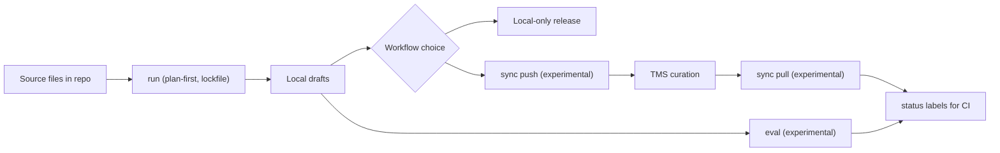

`hyperlocalise` helps you generate local translation drafts, optionally sync with your TMS, and track what still needs review.

## Tập trung vào nền tảng

- Lớp cung cấp LLM: OpenAI, Azure OpenAI, Gemini, Anthropic, AWS Bedrock, LM Studio, Groq, Ollama
- TMS adapters (thử nghiệm): Crowdin, LILT AI, Lokalise, Phrase, POEditor, Smartling
- Khung đánh giá (thử nghiệm): kiểm tra chất lượng và kiểm tra lỗi trên nhiều ngôn ngữ/mô hình
- Nhãn trạng thái sẵn sàng cho CI (thử nghiệm): `ready` / `needs review` / `missing`
- Lên kế hoạch trước + tệp khóa: chạy và so sánh theo cách nhất quán và có thể kiểm tra

## Граф đặc trưng

## Đây dành cho ai

Sử dụng giao diện dòng lệnh này nếu bạn:

- lu trữ các tệp bản dịch trong kho lưu trữ của bạn
- muốn có bản nháp do AI tạo ra làm điểm khởi đầu
- muốn lựa chọn giữa quy trình không cần con người và lựa chọn con người trong TMS của bạn.

## Luồng làm việc chính

| Giai đoạn | Hành động | Tại sao điều này quan trọng |
| --- | --- | --- |
| 1 | [`init`](/commands/init) | Scaffold `i18n.jsonc` and bootstrap defaults. |
| 2 | Configure [`i18n config`](/configuration/i18n-config) | Define locales, buckets, and LLM/storage settings. |
| 3 | [`run --dry-run`](/commands/run) | Validate plan and detect issues before writing drafts. |
| 4 | [`run`](/commands/run) | Generate local draft translations. |
| 5 | [Giải phóng từ kho lưu trữ cục bộ](/commands/run) | Đường dẫn không cần người dùng khi quy trình của bạn cho phép xuất bản trực tiếp từ đầu ra đã tạo. |
| 6 (tùy chọn) | [`sync push` (thử nghiệm)](/commands/sync-push) | Tải lên các thay đổi cục bộ lên TMS của bạn để sử dụng trong quy trình làm việc. |
| 7 (tùy chọn) | Kiểm duyệt trong TMS | Xem xét và chỉnh sửa do con người trên nền tảng dịch thuật của bạn. |
| 8 (optional) | [`sync pull` (experimental)](/commands/sync-pull) | Bring curated translations back into the repository. |
| 9 | [`status`](/commands/status) | Đo lường mức độ hoàn thành và công việc chưa hoàn thành trên cả hai luồng quy trình. |

## Bắt đầu trong 10 phút

1. [Cài đặt](/getting-started/install).
2. [Bắt đầu nhanh](/getting-started/quickstart).
3. [Thiết lập cấu hình i18n của bạn](/configuration/i18n-config).

## Các bước tiếp theo phổ biến

- Tìm hiểu về cách hoạt động của lệnh trong [Tổng quan lệnh](/commands/overview).
- Configure provider credentials in [provider credentials](/configuration/provider-credentials).
- Hiểu rõ về hành vi đồng bộ trong [tóm tắt kho lưu trữ](/storage/overview).
- Đánh giá mức độ trưởng thành của tính năng trong [ma trận tính ổn định](/reference/stability-matrix).
