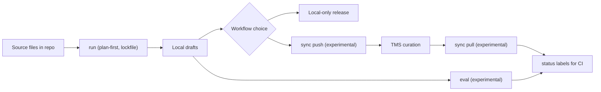

`hyperlocalise` giúp bạn tạo bản nháp dịch cục bộ, đồng bộ với TMS của bạn nếu muốn, và theo dõi những gì vẫn cần được xem xét.

## Trọng tâm nền tảng

- Lớp nhà cung cấp LLM: OpenAI, Azure OpenAI, Gemini, Anthropic, AWS Bedrock, LM Studio, Groq, Ollama
- Bộ điều hợp TMS (thử nghiệm): Crowdin, LILT AI, Lokalise, Phrase, POEditor, Smartling
- Khung đánh giá (thử nghiệm): kiểm tra chất lượng + hồi quy trên các ngôn ngữ/mô hình
- Nhãn trạng thái sẵn sàng cho CI (thử nghiệm): `ready` / `needs review` / `missing`
- Lập kế hoạch trước + lockfile: các lần chạy có tính xác định và các diff có thể xem xét

## Đồ thị tính năng

## Dành cho ai?

Dùng CLI này nếu bạn:

- giữ các tệp dịch trong kho lưu trữ của bạn,
- muốn các bản nháp do AI tạo ra làm điểm khởi đầu,
- muốn chọn giữa quy trình không có người và tuyển chọn thủ công tùy chọn trong TMS của bạn.

## Quy trình cốt lõi

| Giai đoạn | Hành động | Vì sao điều này quan trọng |
| --- | --- | --- |
| 1 | [`init`](/commands/init) | Khung `i18n.yml` và các mặc định bootstrap. |
| 2 | Cấu hình [`i18n config`](/configuration/i18n-config) | Xác định các ngôn ngữ, bucket và cài đặt LLM/lưu trữ. |
| 3 | [`run --dry-run`](/commands/run) | Xác thực kế hoạch và phát hiện các vấn đề trước khi viết bản nháp. |
| 4 | [`run`](/commands/run) | Tạo bản dịch nháp cục bộ. |
| 5 | [Phát hành từ kho lưu trữ cục bộ](/commands/run) | Đường đi không có con người khi quy trình của bạn cho phép xuất bản trực tiếp từ đầu ra đã tạo. |
| 6 (tùy chọn) | [`sync push` (thử nghiệm)](/commands/sync-push) | Tải các thay đổi cục bộ lên TMS của bạn để phục vụ quy trình biên tập. |
| 7 (tùy chọn) | Chỉnh sửa trong TMS | Xem xét và chỉnh sửa thủ công trong nền tảng dịch thuật của bạn. |
| 8 (tùy chọn) | [`sync pull` (thử nghiệm)](/commands/sync-pull) | Đưa các bản dịch được tuyển chọn trở lại kho lưu trữ. |
| 9 | [`status`](/commands/status) | Đo lường mức độ hoàn thành và phần việc chưa giải quyết ở bất kỳ đường đi quy trình nào. |

## Bắt đầu sau 10 phút

1. [Phần cài đặt](/getting-started/install).
2. [Chạy hướng dẫn bắt đầu nhanh](/getting-started/quickstart).
3. [Thiết lập cấu hình i18n của bạn](/configuration/i18n-config).

## Các bước tiếp theo thường gặp

- Tìm hiểu hành vi lệnh trong [tổng quan về lệnh](/commands/overview).
- Cấu hình thông tin xác thực của nhà cung cấp trong [provider credentials](/configuration/provider-credentials).
- Tìm hiểu hành vi đồng bộ trong [tổng quan về lưu trữ](/storage/overview).
- Xem xét mức độ hoàn thiện của tính năng trong [ma trận độ ổn định](/reference/stability-matrix).
