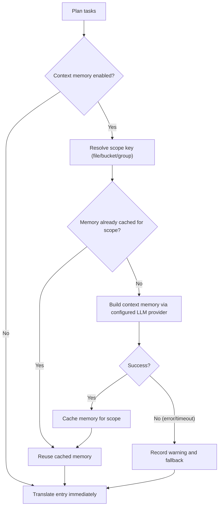

## 用法

```bash
hyperlocalise run [--config <path>] [--group <name>] [--bucket <name>] [--locale <locale>] [--dry-run] [--workers <count>] [--output <report.json>] [--experimental-context-memory] [--context-memory-scope <file|bucket|group>] [--context-memory-max-chars <count>]
```

## 行为

1. 加载并验证配置，
2. 从组和分桶中规划任务，
3. 跳过已在`.hyperlocalise.lock.json`中的任务，
4. 执行剩余任务，
5. 将成功的任务持久化以锁定状态。

对于 lockfile 字段、生命周期和重置指导，请参见 [Lockfile 合约](/reference/lockfile-contract)。

## 支持的本地文件格式

`run` 可以读取具有以下扩展名的源文件和目标文件：

- `.json`
- `.arb`
- `.xlf` 和 `.xliff`
- `.po`
- `.html`
- `.md`
- `.mdx`
- `.strings`
- `.stringsdict`
- `.csv`

对于 JSON（`.json`），`run` 支持：

- 标准嵌套键/值 JSON 对象
- 当根严格匹配时的 FormatJS 消息 JSON：
  `{"[id]": {"defaultMessage": "[message]", "description": "[description]"}}`

在 FormatJS 模式下，只有 `defaultMessage` 会被翻译。键（消息 ID）、`description` 以及其他非消息元数据都会保留。

对于 Flutter ARB（`.arb`），`run` 仅翻译消息键，保留诸如 `@key` 之类的元数据键，并在写入时将 `@@locale` 规范化为目标区域设置。

对于 Markdown 和 MDX（`.md`, `.mdx`），`run` 会翻译提取出的散文内容，并保留不可翻译的结构：

- frontmatter 块（`---`）
- 围栏代码块（```` ``` ```` 和 `~~~`）
- 内联代码片段
- Markdown 锚点，例如链接目标
- MDX `import` 和 `export` 行
- JSX/MDX 组件标签和属性值

对于 HTML（`.html`），`run` 会转换块级元素内的文本内容：

- `<script>`、`<style>`、`<pre>` 和 `<head>` 内容永远不会被翻译，并会原样保留
- 可翻译片段中的内联标签（`<strong>`、`<em>`、`<a>` 等）——标签标记会作为占位符受到保护，并在翻译后原样恢复，但周围的正文**会**被翻译
- `` — `alt` 属性值被提取为其独立的翻译单元；标签的其余部分（src、class 等）将按原样保留
- HTML 实体（`&amp;`、`&lt;`等）在翻译往返过程中会保持原样
- HTML 注释会原样保留

对于 Apple/Xcode 字符串（`.strings`），`run` 会保留模板中的注释和键/值格式，同时将值字面量替换为翻译后的文本。


对于 CSV（`.csv`），`run` 支持两种布局：

- 键/值布局（例如：`key,value`）
- 按语言区域的列布局（例如：`id,en,fr,de`）

在写入 CSV 目标时，`run` 会保留现有表头和非目标列，原地更新匹配的键，并按确定性的排序顺序追加新键。

## 标志

- `--config`：配置文件路径（默认 `i18n.yml`，回退到当前目录中的 `i18n.jsonc`）
- `--group`：仅运行指定组名的任务
- `--bucket`：仅为给定的桶名称运行任务
- `--locale`：仅为给定目标区域设置运行任务（可重复）；`--target-locale` 是一个别名
- `--dry-run`：仅打印计划，不要翻译或写入文件
- `--force`：重新运行所有计划任务，并忽略锁文件跳过状态
- `--prune`：删除源文件中不再存在的目标键
- `--prune-max-deletions`：在需要显式覆盖之前，一次运行中删除的最大过期键数（默认 `100`）
- `--prune-force`：绕过修剪删除安全限制
- `--workers`：并行翻译工作线程数（默认为 CPU 核心数）
- `--progress`：进度渲染模式（`auto|on|off`，默认：`auto`）
- `--output`：将机器可读的 JSON 运行报告写入给定路径
- `--experimental-context-memory`：在翻译每个作用域之前启用两阶段上下文记忆生成
- `--context-memory-scope`：上下文共享范围（`file|bucket|group`，默认`file`）
- `--context-memory-max-chars`：注入到每个翻译请求中的最大上下文内存长度（默认值`1200`）

## 提示契约适用于`run`

- `system_prompt` 用于说明和运行时上下文。
- `user_prompt` 用于有效负载内容（要翻译的文本，或用于上下文记忆摘要的源内容）。
- 翻译流程支持配置文件`user_prompt`覆盖。
- 上下文记忆摘要流程始终使用内置的摘要负载模板，不会应用配置文件 `user_prompt` 覆盖。

<Note>
更改提示结构（例如将上下文从用户消息移到系统消息）不会自动使缓存的翻译失效。若要在重构提示后强制重新翻译，请在您的配置文件中提升 `prompt_version`。
</Note>

### 进度调试日志（可选）

要排查进度渲染问题，你可以在不更改 CLI 标志的情况下启用调试日志：

- `HYPERLOCALISE_PROGRESS_DEBUG=1` 启用进度调试日志。
- `HYPERLOCALISE_PROGRESS_DEBUG_FILE=<path>` 覆盖日志文件位置。

启用时的默认日志路径：`.hyperlocalise/logs/run.log`。

## 实验性上下文记忆流

当 `--experimental-context-memory` 启用时，`run` 会在每个作用域内构建一次共享内存（默认：每个源文件一次），然后在该作用域内的所有条目中复用它。

如果内存生成失败或超时，`run` 会记录一条警告，并在该范围内不使用共享内存继续翻译。



### 为什么它看起来像是在等待

- 新作用域中的第一个条目会等待内存生成完成。
- 后续在同一作用域中的条目会重用缓存内存，并继续执行而无需重新构建。
- 进度 UI 现在会在文件列表中显示上下文记忆步骤，因此你可以看到当前作用域级别的工作。


## 作用范围延伸至一个组

当你只想运行一个已配置的组时，请使用`--group`。

```bash
hyperlocalise run --group tests --dry-run
```

如果你的配置中不存在该组，`run` 会因 `unknown group` 规划错误而失败。

## 范围适用于一个桶

当你只想运行一个已配置的桶时，请使用`--bucket`。这对于有针对性的更新、CI 分区，或在完整运行之前验证单个区域都很有用。

```bash
hyperlocalise run --bucket ui --dry-run
```

如果你的配置中不存在该 bucket，`run` 会因 `unknown bucket` 规划错误而失败。

## 范围适用于一个目标语言环境

当你只想重新运行特定区域设置而不更改组或桶选择时，请使用 `--locale`。你可以重复使用该标志来选择多个区域设置。为兼容旧脚本，同样的筛选器也可作为 `--target-locale` 使用。

```bash
hyperlocalise run --group tests --locale fr --locale de --dry-run
```

如果请求的区域设置不在 `locales.targets` 中，`run` 会因 `unknown target locale` 计划错误而失败。与 `--group` 结合使用时，只会计划属于该组的区域设置。

当与`--prune`结合使用时，过时键检测也仅限于所选目标语言环境。`run`只会扫描并清理属于已筛选语言环境集合的目标文件。

```bash
hyperlocalise run --prune --locale de --dry-run
```

## 强制重新运行所有计划任务

使用`--force`来忽略锁文件跳过状态，并再次执行所有计划任务。

```bash
hyperlocalise run --group tests --force
```

## 输出字段

- `planned_total`
- `skipped_by_lock`
- `executable_total`
- `succeeded`
- `failed`
- `persisted_to_lock`
- `prompt_tokens`
- `completion_tokens`
- `total_tokens`

每个语言区域的令牌使用情况显示为：`locale_usage locale=<locale> prompt_tokens=<...> completion_tokens=<...> total_tokens=<...>`。

当你传递`--output`时，JSON 报告会包含运行元数据（`generatedAt`、`configPath`）、汇总的令牌使用情况、按语言区域的使用情况，以及按条目的批处理使用情况。

## 失败输出

在任务失败时，输出包括`failure target=<...> key=<...> reason=<...>`。


## 工作器调优指南

在遇到提供商速率限制或在受限的 CI 环境中运行时，请降低 `--workers`。先从 `1` 开始，以稳定重试，然后再逐步增加。

当您的提供商配额和机器资源允许更多吞吐量时，提高 `--workers`。请小幅度递增，并留意 API 错误率以及本地 CPU 和内存使用情况。

## 另请参见

- [eval](/commands/eval)
- [状态](/commands/status)
- [sync push](/commands/sync-push)
- [sync pull](/commands/sync-pull)
- [锁定文件契约](/reference/lockfile-contract)
