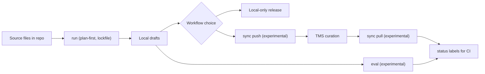

`hyperlocalise` helps you generate local translation drafts, optionally sync with your TMS, and track what still needs review.

## 平台重点

- LLM 提供商层：OpenAI、Azure OpenAI、Gemini、Anthropic、AWS Bedrock、LM Studio、Groq、Ollama
- TMS 适配器 (实验性)：Crowdin, LILT AI, Lokalise, Phrase, POEditor, Smartling
- 评估框架（实验）：跨区域/模型上的质量和回归检查
- CI 准备状态标签（实验性）：`ready` / `needs review` / `missing`
- 先规划 + 锁定文件：可重复运行并可审查差异

## 特征图

## 这是给谁的

如果您：
请使用此 CLI

- 请将翻译文件保存在您的仓库中。
- 希望获得由 AI 生成的草稿作为起点
- 您想在您的 TMS 中选择使用完全自动化流程还是使用可选的人工审核？

## 核心工作流程

| 阶段 | 动作 | 为什么重要 |
| --- | --- | --- |
| 1 | [`init`](/commands/init) | 骨架和默认设置 |
| 2 | Configure [`i18n config`](/configuration/i18n-config) | Define locales, buckets, and LLM/storage settings. |
| 3 | [`run --dry-run`](/commands/run) | Validate plan and detect issues before writing drafts. |
| 4 | [`run`](/commands/run) | Generate local draft translations. |
| 5 | [从本地仓库发布](/commands/run) | 在您的进程允许直接从生成输出发布时，无需人工干预。 |
| 6 (可选) | [`sync push` (实验性)](/commands/sync-push) | 将本地更改上传到您的 TMS，以便进行内容管理流程。 |
| 7 (可选) | 在 TMS 中进行精修 | 在您自己的翻译平台上进行人工审核和校对。 |
| 8 (optional) | [`sync pull` (experimental)](/commands/sync-pull) | Bring curated translations back into the repository. |
| 9 | [`status`](/commands/status) | Measure completion and unresolved work in either workflow path. |

## 10分钟后开始

1. [安装](/getting-started/install)。
2. [快速启动](/getting-started/quickstart).
3. [设置您的i18n配置](/configuration/i18n-config)。

## 常见后续步骤

- 了解命令行为，请参阅 [命令概览](/commands/overview)].
- 在 [提供商凭据](/configuration/provider-credentials)] 中配置提供商凭据。
- Understand sync behavior in [storage overview](/storage/overview).
- 审查 [稳定性矩阵](/reference/stability-matrix)] 中的功能成熟度。
