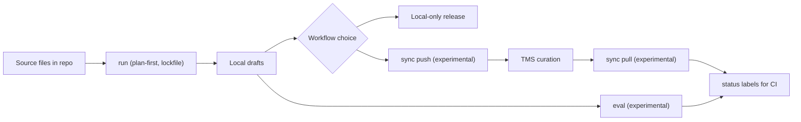

`hyperlocalise` 可帮助你生成本地翻译草稿，可选择与 TMS 同步，并跟踪仍需审核的内容。

## 平台重点

- LLM 提供层：OpenAI、Azure OpenAI、Gemini、Anthropic、AWS Bedrock、LM Studio、Groq、Ollama
- TMS 适配器（实验性）：Crowdin、LILT AI、Lokalise、Phrase、POEditor、Smartling
- 评估框架（实验性）：跨语言/模型的质量 + 回归检查
- CI 就绪状态标签（实验性）：`ready` / `needs review` / `missing`
- 先规划 + 锁文件：可确定的运行和可审查的差异

## 功能图谱

## 适用于谁

如果你符合以下情况，请使用此 CLI：

- 将翻译文件保存在你的仓库中，
- 想要将 AI 生成的草稿作为起点，
- 想在您的 TMS 中选择零人工工作流和可选人工审核之间的方案。

## 核心工作流

| 阶段 | 操作 | 重要性 |
| --- | --- | --- |
| 1 | [`init`](/commands/init) | 搭建 `i18n.yml` 并引导默认值。 |
| 2 | 配置 [`i18n config`](/configuration/i18n-config) | 定义区域设置、桶和 LLM/存储设置。 |
| 3 | [`run --dry-run`](/commands/run) | 在撰写草稿之前验证计划并发现问题。 |
| 4 | [`run`](/commands/run) | 生成本地草稿翻译。 |
| 5 | [从本地仓库发布](/commands/run) | 当你的流程允许直接从生成的输出进行发布时的零人工路径。 |
| 6（可选）| [`sync push`（实验性）](/commands/sync-push) | 将本地更改上传到您的 TMS 以用于整理工作流。 |
| 7（可选）| 在 TMS 中整理 | 在你的翻译平台中进行人工审校和修正。 |
| 8（可选）| [`sync pull`（实验性）](/commands/sync-pull) | 将精选翻译带回仓库。 |
| 9 | [`status`](/commands/status) | 衡量任一工作流路径中的完成情况和未解决的工作。 |

## 10 分钟后开始

1. [安装](/getting-started/install).
2. [运行快速入门](/getting-started/quickstart)。
3. [设置你的 i18n 配置](/configuration/i18n-config)。

## 常见的下一步

- 了解 [命令概览](/commands/overview) 中的命令行为。
- 在[provider credentials](/configuration/provider-credentials)中配置提供商凭据。
- 了解 [storage overview](/storage/overview) 中的同步行为。
- 查看 [稳定性矩阵](/reference/stability-matrix)中的功能成熟度。
